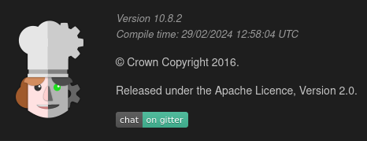

# CyberChef Installation script

### Bash script automating the installation of the latest version of GCHQ's CyberChef on Debian 10 or 11

The final build of CyberChef will be located in 
- /var/www/CyberChef

### Design principles:
  - Create a production build of CyberChef on a (disposable) system with Vagrant. This system has the hostname *charpentier*.
  - Copy the production build to the virtual host server in the ./CyberChef directory.
  - Create another Virtual Server using NGINX as the webserver for the build created in the previous step. This has the hostname *cyberchef*.
  - Alternatively copy the build to another Web Server and install NGINX there.

<b>Note:</b> CyberChef now supports Node 16. For a long time Node 10 was a requirement which became an issue.

----

## Latest changes

### 2022-12-02 - Tested with CyberChef 9.54.0
- Build version 9.54.0

### 2022-11-23 - Latest version of CyberChef and Node 16
- Not sure how long this has been broken, but now tested with the latest version (2022-11-11) of CyberChef which runs on Node 16


### 2022-01-07 - Less verbose output
- Less cluttered console during installation due to less verbose output

### 2021-12-26 - First commit
- Two virtual machines created. Remove the first after successful installation of both servers.
- \# vagrant destroy charpentier
  
---
The simplified installation-flow is depicted below.


You can either just create the build and copy it manually to another system. By using
``` vagrant up charpentier ``` 

or you can let it create the webserver automatically, using
``` vagrant up charpentier cyberchef ```

If you need to start over again, use ``` vagrant destroy -f charpentier cyberchef; vagrant up charpentier cyberchef ```

---

## CyberChef - The Cyber Swiss Army Knife
From "about" in the web app:

*CyberChef is a simple, intuitive web app for analysing and decoding data without having to deal with complex tools or programming languages. CyberChef encourages both technical and non-technical people to explore data formats, encryption and compression.*





To learn more about CyberChef, I recommmend these resources:
CyberChef Wiki: https://github.com/gchq/CyberChef/wiki
Training: https://www.networkdefense.co/courses/cyberchef/
